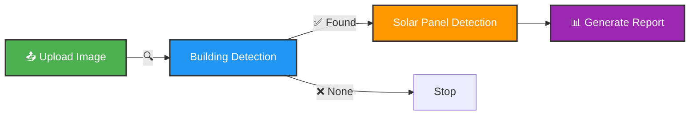

<div align="center">

# ☀️ SolarScope


### *Illuminating the Future of Renewable Energy*

[](https://www.python.org/)
[](https://pytorch.org/)
[](https://flask.palletsprojects.com/)
[](LICENSE)

**Transforming satellite imagery into actionable solar energy insights using cutting-edge AI**

[](https://youtube.com/watch?v=IAHdLHxnRCk&feature=youtu.be)

[🚀 Quick Start](#-installation) • [📖 Documentation](#-usage) • [🎯 Features](#-features) • [🤝 Contributing](#-contributing)

---

</div>

## 🌟 What is SolarScope?

SolarScope is an intelligent, **AI-powered web application** that revolutionizes solar energy assessment by automatically detecting:
- 🏗️ **Buildings & Rooftops** from satellite/aerial imagery
- ☀️ **Existing Solar Panels** on detected structures
- 📊 **Installation Potential** for renewable energy deployment

Using a sophisticated **dual-model sequential pipeline**, SolarScope combines **DeepLab V3+** semantic segmentation with **Faster R-CNN** object detection to deliver precise, actionable insights for solar energy planning.

<div align="center">



</div>

## ✨ Features

<table>
<tr>
<td width="50%">

### 🤖 AI-Powered Detection
- **DeepLab V3+** with ResNet-50 backbone
- **Faster R-CNN** for solar panel identification
- Sequential pipeline optimization
- Real-time confidence scoring

</td>
<td width="50%">

### 🎨 Modern Interface
- Drag & drop file upload
- Live progress indicators
- Interactive visualizations
- Responsive design

</td>
</tr>
<tr>
<td width="50%">

### 📊 Comprehensive Analytics
- Building coverage statistics
- Solar panel count & locations
- GeoJSON export capability
- Detailed confidence metrics

</td>
<td width="50%">

### 🚀 Production Ready
- RESTful API endpoints
- Health monitoring
- Error handling
- Scalable architecture

</td>
</tr>
</table>

---

## 🏗️ Architecture

<div align="center">

### 🔄 Detection Pipeline

```ascii
┌──────────────┐
│ Upload Image │
│   📷 .tif    │
└──────┬───────┘
       │
       ▼
┌──────────────────┐
│ Building Detect  │
│  DeepLab V3+     │
└──────┬───────────┘
       │
       ├─────► Buildings Found? ──NO──► ❌ Stop
       │
       YES
       ▼
┌──────────────────┐
│ Solar Panel Det  │
│  Faster R-CNN    │
└──────┬───────────┘
       │
       ▼
┌──────────────────┐
│  📊 Results &    │
│   GeoJSON Export │
└──────────────────┘
```

</div>

### 🧠 AI Models

<table>
<tr>
<th>Model</th>
<th>Purpose</th>
<th>Architecture</th>
<th>Output</th>
</tr>
<tr>
<td><b>DeepLab V3+</b></td>
<td>Building Segmentation</td>
<td>ResNet-50 Backbone</td>
<td>Binary Mask (256×256)</td>
</tr>
<tr>
<td><b>Faster R-CNN</b></td>
<td>Solar Panel Detection</td>
<td>Object Detection</td>
<td>Bounding Boxes + GeoJSON</td>
</tr>
</table>

---

## 📁 Project Structure

```bash
SolarScope/
│
├── 🎯 app.py                      # Flask application server
├── 🧠 models_module.py            # AI model inference engine
├── ⚙️  config.py                   # Configuration & settings
├── 📋 requirements.txt            # Dependencies
├── 📖 README.md                   # Documentation (you are here!)
├── 🚫 .gitignore                  # Git exclusions
│
├── 🤖 models/                     # Pre-trained model weights
│   ├── deeplabv3plus_buildings_state_*.pth
│   └── best_model.pth
│
├── 📂 static/
│   ├── 📤 uploads/               # User uploaded images
│   └── 📊 results/               # Detection outputs & GeoJSON
│
├── 🎨 templates/
│   ├── index.html                # Main web interface
│   └── about.html                # About page
│
└── 📓 Deeplab V3+_train/         # Training notebooks
    └── deeplab_v3_building_detection.ipynb
```

---


## 🚀 Installation

> **Prerequisites**: Python 3.8+ | pip | Git

### 📦 Quick Start

<details open>
<summary><b>Windows (PowerShell)</b></summary>

```powershell
# 1️⃣ Clone the repository
git clone https://github.com/michael2505byte/SolarScope.git
cd SolarScope

# 2️⃣ Create virtual environment
python -m venv venv
.\venv\Scripts\Activate.ps1

# 3️⃣ Install dependencies
pip install -r requirements.txt

# 4️⃣ Download pre-trained models
# Download from: https://drive.google.com/drive/folders/1Z471pir3Q7x096WscPsXnW3hgyMEmqk0
# Place in models/ directory

# 5️⃣ Verify installation
python config.py

# 6️⃣ Launch application
python app.py
```

</details>

<details>
<summary><b>Linux / macOS</b></summary>

```bash
# 1️⃣ Clone the repository
git clone https://github.com/michael2505byte/SolarScope.git
cd SolarScope

# 2️⃣ Create virtual environment
python3 -m venv venv
source venv/bin/activate

# 3️⃣ Install dependencies
pip install -r requirements.txt

# 4️⃣ Download pre-trained models (we have already trained it on our system,if you want to train it yourself you can run the training notebooks)
# Download from: https://drive.google.com/drive/folders/1Z471pir3Q7x096WscPsXnW3hgyMEmqk0
# Place in models/ directory

# 5️⃣ Verify installation
python config.py

# 6️⃣ Launch application
python app.py
```

</details>

### 🤖 Model Setup

```powershell
# Download models from Google Drive
# https://drive.google.com/drive/folders/1Z471pir3Q7x096WscPsXnW3hgyMEmqk0

# Expected files in models/ directory:
# ├── deeplabv3plus_buildings_state_20250930_021413.pth
# └── best_model.pth
```

<div align="center">

**🎉 Ready to Go!** Visit `http://localhost:5000` in your browser

</div>

---


## 🎮 Usage Guide

### 🌐 Starting the Server

```bash
python app.py
# 🚀 Server running at http://localhost:5000
```

### 📸 Detection Workflow

<table>
<tr>
<td width="5%">1️⃣</td>
<td width="95%">
<b>Upload Image</b><br/>
• Drag & drop or click to browse<br/>
• Supported: PNG, JPG, TIFF, GeoTIFF<br/>
• <i>Recommended: GeoTIFF for geo-referencing</i>
</td>
</tr>

<tr>
<td>2️⃣</td>
<td>
<b>Configure Detection</b><br/>
• Adjust confidence thresholds (optional)<br/>
• Set window size & overlap for large images<br/>
• Review detection parameters
</td>
</tr>

<tr>
<td>3️⃣</td>
<td>
<b>Run Sequential Detection</b><br/>
• Click "Start Sequential Detection"<br/>
• Watch real-time progress indicators<br/>
• Phase 1: Building detection → Phase 2: Solar panels
</td>
</tr>

<tr>
<td>4️⃣</td>
<td>
<b>Analyze Results</b><br/>
• View segmentation masks & overlays<br/>
• Examine detected solar panels<br/>
• Download GeoJSON files<br/>
• Review statistics & metrics
</td>
</tr>

<tr>
<td>5️⃣</td>
<td>
<b>Export & Share</b><br/>
• Download visualization images<br/>
• Export GeoJSON for GIS applications<br/>
• Save TIFF masks for further analysis
</td>
</tr>
</table>

---


## 📊 Detection Outputs

### 🏗️ Building Detection Results

| Output | Description | Format |
|--------|-------------|--------|
| 🎭 **Segmentation Mask** | Binary mask highlighting buildings | PNG |
| 🔴 **Overlay Image** | Buildings highlighted in red on original | PNG |
| 📈 **Statistics** | Coverage %, confidence, pixel counts | JSON |
| 📐 **Dimensions** | Image resolution & processing details | JSON |

### ☀️ Solar Panel Detection Results

| Output | Description | Format |
|--------|-------------|--------|
| 📦 **Bounding Boxes** | Detected panel locations with labels | PNG |
| 🗺️ **GeoJSON** | Vectorized polygons with coordinates | GeoJSON |
| 📋 **Panel List** | Individual detections with confidence | JSON |
| 🎯 **TIFF Masks** | Geo-referenced detection masks | TIFF |
| 📊 **Count & Stats** | Total panels & area coverage | JSON |

### 📝 Example Output Structure

```json
{
  "success": true,
  "building_detection": {
    "detected": true,
    "coverage_percentage": 32.5,
    "confidence": 0.92,
    "building_pixels": 84832
  },
  "solar_panel_detection": {
    "detected": true,
    "count": 12,
    "avg_confidence": 0.87,
    "geojson_path": "/static/results/solar_panels.geojson"
  }
}
```

---


## ⚙️ Configuration

Customize detection parameters in [config.py](config.py):

```python
# 🎯 Detection Thresholds
BUILDING_DETECTION_THRESHOLD = 1.0       # Minimum building coverage (%)
BUILDING_CONFIDENCE_THRESHOLD = 0.5      # Minimum confidence score
SOLAR_PANEL_CONFIDENCE_THRESHOLD = 0.5   # Panel detection threshold

# 🔧 Processing Parameters
SOLAR_PANEL_WINDOW_SIZE = 512            # Detection window size
SOLAR_PANEL_OVERLAP = 256                # Overlap between windows
MAX_VISUALIZATION_DIMENSION = 2048       # Max image size for display

# 🖥️ Server Settings
DEFAULT_PORT = 5000                      # Flask server port
DEBUG_MODE = True                        # Enable debug logging
DEVICE = 'cuda'                          # 'cuda' or 'cpu'
```

---


## 🐛 Troubleshooting

<details>
<summary><b>❌ Model Not Loading</b></summary>

```bash
# Verify model files exist
ls models/

# Check PyTorch installation
python -c "import torch; print(torch.__version__)"

# Ensure correct file names in config.py
# Expected: deeplabv3plus_buildings_state_*.pth and best_model.pth
```

</details>

<details>
<summary><b>⚠️ Solar Panel Detection Not Working</b></summary>

- ✅ Ensure input image is **GeoTIFF format**
- ✅ Verify `geoai` library is installed: `pip show geoai`
- ✅ Check model path in configuration
- ✅ Ensure buildings were detected in Phase 1

</details>

<details>
<summary><b>💾 Out of Memory Errors</b></summary>

```python
# In config.py, reduce these values:
SOLAR_PANEL_WINDOW_SIZE = 256  # Default: 512
MAX_VISUALIZATION_DIMENSION = 1024  # Default: 2048

# Or force CPU usage:
DEVICE = 'cpu'  # Default: 'cuda'
```

</details>

<details>
<summary><b>📦 Import Errors</b></summary>

```bash
# Reinstall all dependencies
pip install -r requirements.txt --force-reinstall

# For geoai specifically
pip install geoai --upgrade

# Verify installations
pip list | grep -E "torch|flask|geoai"
```

</details>

<details>
<summary><b>🌐 Server Won't Start</b></summary>

- Check port 5000 is not in use: `netstat -ano | findstr :5000`
- Try different port in config.py: `DEFAULT_PORT = 8000`
- Check firewall settings
- Ensure virtual environment is activated

</details>

---


## 🔌 API Reference

### `POST /detect`

Performs sequential building and solar panel detection.

**Request:**
```http
POST /detect HTTP/1.1
Content-Type: multipart/form-data

file: <image_file>
confidence_threshold: 0.5 (optional)
window_size: 512 (optional)
overlap: 256 (optional)
```

**Response:**
```json
{
  "success": true,
  "original_image": "/static/uploads/image.tif",
  "building_detection": {
    "detected": true,
    "prediction_mask": "/static/results/mask.png",
    "overlay_image": "/static/results/overlay.png",
    "statistics": {
      "coverage_percentage": 25.3,
      "confidence": 0.89
    }
  },
  "solar_panel_detection": {
    "detected": true,
    "count": 8,
    "detections": [...],
    "visualization": "/static/results/panels.png",
    "geojson": "/static/results/panels.geojson"
  }
}
```

### `GET /health`

Health check endpoint for monitoring.

**Response:**
```json
{
  "status": "healthy",
  "building_model_loaded": true,
  "solar_panel_model_loaded": true,
  "device": "cuda",
  "version": "1.0.0"
}
```

---


## 🔬 Technical Details

<details>
<summary><b>🏗️ Building Detection Model</b></summary>

- **Architecture**: DeepLab V3+ with ResNet-50 backbone
- **Framework**: PyTorch 
- **Input Size**: 256×256 RGB images
- **Output**: Binary segmentation mask (building/background)
- **Training**: Custom dataset with building annotations
- **Threshold**: 1% building coverage to trigger solar detection
- **Preprocessing**: Resize, normalize, tensor conversion

</details>

<details>
<summary><b>☀️ Solar Panel Detection Model</b></summary>

- **Architecture**: Faster R-CNN
- **Framework**: PyTorch with geoai wrapper
- **Input**: GeoTIFF images (variable resolution)
- **Processing**: Sliding window (512×512) with 256px overlap
- **Output**: Bounding boxes + confidence scores + GeoJSON polygons
- **Post-processing**: Non-maximum suppression, coordinate transformation
- **Geo-referencing**: Maintains spatial coordinates in output

</details>

<details>
<summary><b>⚡ Performance Optimization</b></summary>

- **GPU Acceleration**: CUDA support for faster inference
- **Batch Processing**: Efficient window-based detection
- **Memory Management**: Dynamic image resizing for large files
- **Caching**: Model weights loaded once at startup
- **Asynchronous I/O**: Non-blocking file operations

</details>

---

## 📄 License

This project combines functionalities from two separate detection systems. Ensure you have appropriate licenses for both models and the geoai library.


## 🤝 Contributing

We welcome contributions! Here's how you can help:

<table>
<tr>
<td width="33%" align="center">
<br/>
<b>Code Improvements</b><br/>
Optimize algorithms<br/>
Add new features<br/>
Fix bugs
</td>
<td width="33%" align="center">
<br/>
<b>Documentation</b><br/>
Improve guides<br/>
Add tutorials<br/>
Write examples
</td>
<td width="33%" align="center">
<br/>
<b>Testing</b><br/>
Report issues<br/>
Test edge cases<br/>
Validate results
</td>
</tr>
</table>

### 🎯 Areas for Improvement

- [ ] 🔋 Add support for batch processing multiple images
- [ ] 📊 Implement model versioning and A/B testing
- [ ] 🎨 Enhanced visualization with 3D building models
- [ ] 🗺️ Integration with mapping APIs (Google Maps, Mapbox)
- [ ] 📱 Mobile-responsive UI improvements
- [ ] 🔄 Real-time model retraining pipeline
- [ ] 📈 Advanced analytics dashboard
- [ ] 🌍 Multi-language support

### 📝 Contribution Guidelines

1. 🍴 Fork the repository
2. 🌿 Create a feature branch: `git checkout -b feature/amazing-feature`
3. 💾 Commit changes: `git commit -m 'Add amazing feature'`
4. 📤 Push to branch: `git push origin feature/amazing-feature`
5. 🎉 Open a Pull Request

---

## � License

This project is licensed under the **MIT License** - see the [LICENSE](LICENSE) file for details.

---

## 🙏 Acknowledgments

<div align="center">

Built with ❤️ and powered by:

[](https://pytorch.org/)
[](https://flask.palletsprojects.com/)
[](https://opencv.org/)
[](https://numpy.org/)

### Special Thanks To

- 🎓 **DeepLab V3+** - for semantic segmentation architecture
- 🔍 **Faster R-CNN** - for object detection framework  
- 📦 **geoai** - Geospatial AI library for solar panel detection
- 🌍 **PyTorch Team** - For the amazing deep learning framework
- 🎨 **Icons8** - For beautiful 3D icons

</div>


---

<div align="center">

### 🌟 Star this repo if you find it useful! 🌟

**Made with 💚 for a sustainable future**


*Empowering renewable energy decisions through artificial intelligence*

---

**SolarScope** © 2026 | [Documentation](README.md) | [Report Bug](https://github.com/michael2505byte/SolarScope/issues) | [Request Feature](https://github.com/michael2505byte/SolarScope/issues)

---

### ⚠️ Important Notice

**This project is for educational and research purposes only.**  
Commercial use or public deployment of this software requires explicit written permission from the author.  
Unauthorized commercial or public use is strictly prohibited.

</div>
